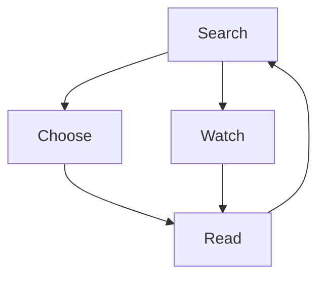

# Cook things :cake: :pie:

1. Use a search engine to find a recipe for the thing you want to cook.
1. Attempt to read the recipe
1. Become frustrated by page reloads, and the seemingly endless storytelling and question whether there really is a recipe or if this is a wily subterfuge
1. Open a new tab
1. Ask YouTube for a recipe
1. Skip past the promotions and watch what happens
1. If the result seemed delicious, copy the actions taken in the video...chances are, the video description will contain a link to a written version :laughing:

<MermaidDiagram>
graph TD;
    Search-->Choose;
    Choose-->Read;
    Read-->Search;
    Search-->Watch;
    Watch-->Read;
</MermaidDiagram>

